# Tutorial_Dialogflow
Antes de iniciar o tutorial, é necessário que se faça uma conta na plataforma através do [Link para o Dialogflow](https://dialogflow.cloud.google.com). O cadastro pode ser feito gratuitamente através de qualquer Gmail, caso você ainda não tenha uma conta. 

### CONFIGURAÇÕES IMPORTANTES
```
Antes de iniciar realmente a se utilizar a plataforma, algumas configurações básicas devem ser feitas. 
Para acessar as configurações avançadas do seu agente basta clicar no ícone de engrenagem como demonstra a imagem a seguir.
```
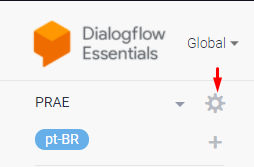  

```
Algumas funcionalidades necessitam da ativação da nova API do Dialogflow, em sua versão V2.
Para que ela seja utilizaeda no seu projeto, uma opção deve ser habilitada (caso ainda não esteja), como mostra a imagem abaixo.
```

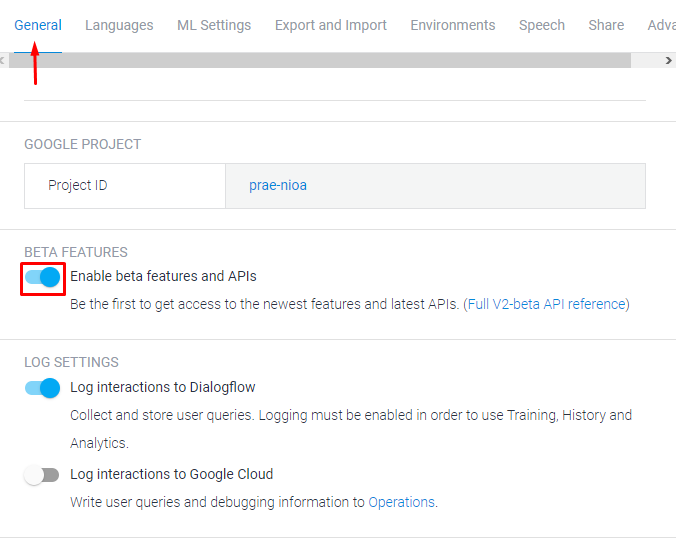  

```
Em "Project ID" está citado o nome do seu projeto. 
Este nome é útil caso você necessite fazer alguma integração com as plataformas do Google Cloud. 
É bom sempre tê-lo em mente. 
```
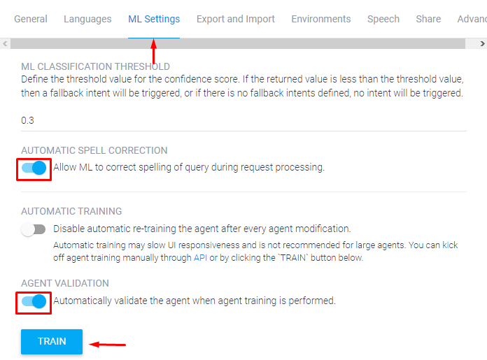  
```
Na aba "ML Settings" estão presentes algumas particularidades do algoritmo de machine learning que será utilizado.
A opção "Automatic Spell Correction" é uma ótima alternativa quando se trata de linguagem natural, 
pois tenta corrigir possíveis errosde digitação do usuário durante a conversa, marque-a caso não esteja ativa. 

Para realizar o treinamento do chatbot sem que seja necessária a adição de nenhuma frase de texto, basta acionar a opção "Train".
```

### PRIMEIROS PASSOS
```
O primeiro passo para a criação de um chatbot é a configuração das intenções. Para acessar o menu de intenções, 
basta clicar na opção que aparecerá na barra a esquerda da tela, como demonstra a imagem.
```
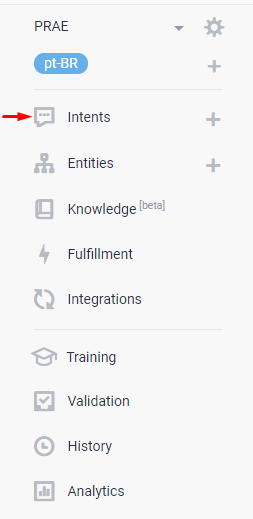  
```
Ao se utilizar a plataforma pela primeira vez, haverão apenas duas intenções que são criadas por padrão pela plataforma.
São elas Default Fallback Intent: intenção acionada caso a inteligência artificial não consiga indentificar o contexto da conversa.
Default Welcome Intent: Intenção padrão de boas-vindas ao usuário, acionada no ínicio de cada conversa.
Para se criar intenções personalizadas, basta clicar na opção "Create Intent", no canto superior direito da tela.
```
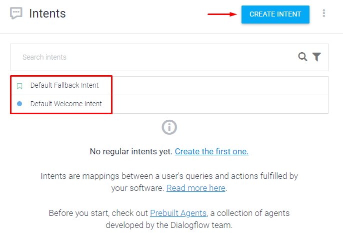 
```
Na criação de uma nova intenção um pequeno menu é acionado, aonde serão configuradas as características daquela intenção.
Context: Caso necessário, é possível adicionar um contexto na qual aquela intenção será acionada, um contexto deve ter um nome e o número de interações de vida útil bem definidos pelo desenvolvedor.
Events: Uma ação programada pelo desenvolvedor que será acionada assim que aquela intenção for correspondida pelo Dialogflow.
Training Phrases: É aqui onde a intenção será realmente desenvolvida, aqui serão adicionadas as frases de teste e como o agente deverá responder caso elas sejam correspondidas.
```
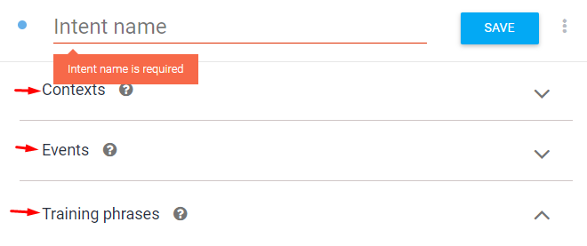 
```
Para que API's e códigos externos ao Dialogflow sejam usados com sucesso, é necessária a ativação da opção 'Fulfillment' no fim da página.
```
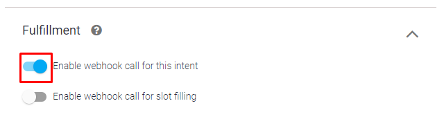 
```
Além da ativação na própria intenção, também é necessário ativar a opção de Fulfillmente para todo o projeto. Para isso, basta acessar a 
opção na aba a direita.
```
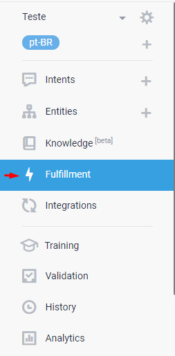
```
É necessário que a opção Webhook esteja como "Enabled". A partir dai, as informações pertinentes ao Webhook da aplicação devem ser
adicionadas nas opções a seguir. É válido salientar que o Dialogflow atende apenas a Requests em HTTPS.
```
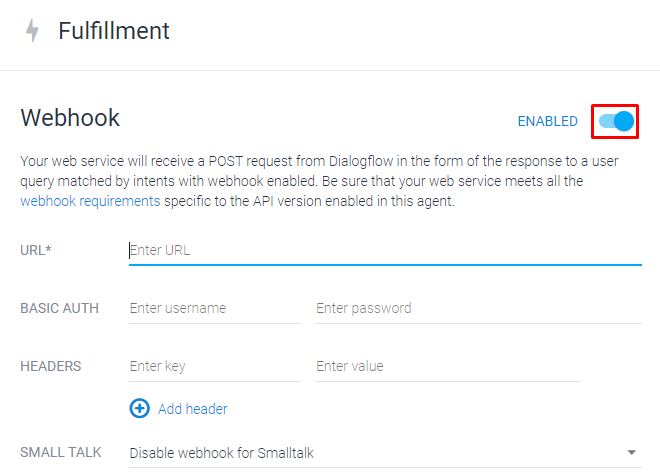
```
Outra opção importante para o desenvolvimento de um projeto são as entidades. As entidades são responsáveis por armazenar informações pertinentes durante uma conversa.
São semelhantes a variáveis em linguagens de programação. Para acessar o perfil de entidades, basta clicar na opção na tabela ao lado esquerdo da tela. 
```
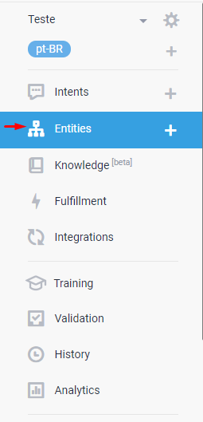
```
A plataforma já implementa algumas variáveis de sistema, como armazenamento de nomes, cores, datas, entre outras. Caso seja necessário a criação
de variáveis personalizadas, basta clicar na opção "Create Entity".
```
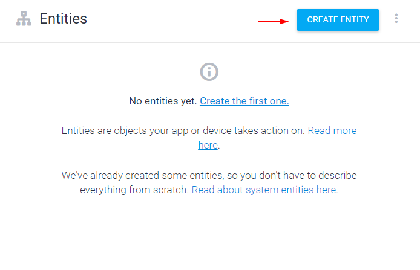
```
Uma entidade é composta por um nome de entidade e sinônimos que se referem a ela. Sinônimos são as informações que serão armazenadas na entidade.
O Dialogflow pede a definição de sinônimos para que a inteligência artificial possa indentificar quando o usuário está se referindo a aquela entidade
durante um diálogo e armazene de forma correta a informação. Caso seja necessária a introdução de mais linhas, basta clicar na opção "Add a row".
```
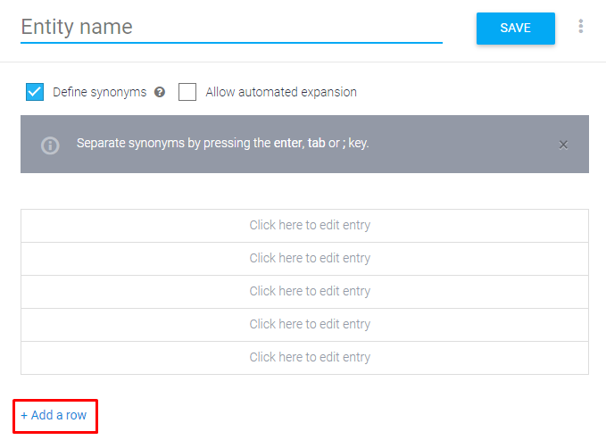

### INTEGRAÇÕES
```
A própria plataforma já disponibiliza para seus usuários um leque de integrações de fácil acesso e implementação através do
Google Cloud Plataform. Para acessar a lista, basta clicar na opção na aba a direita.
```
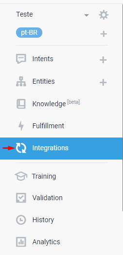
```
Como é uma lista muito extensa, mostrarei apenas as que envolvem a resposta por texto, utilizando como exemplo a plataforma do Telegram.
Uma vez nesta página, basta clicar na opção que queria utilizar para acessar ao menu de opções daquela integração.
```
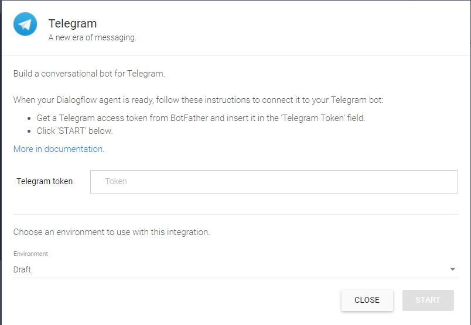
```
No caso do Telegram, a integração é feita através do sistema de manuntenção de bots chamado BotFather.
Após a sua criação na própria plataforma, basta inserir o Token de acesso gerado na opção abaixo e clicar em "START" para que o serviço se torne ativo.
```

### VERIFICAÇÃO DE RESULTADOS
```
Outra opção importante durante o desenvolvimento do chatbot é verificar o andamento das requisições.
Para fazer isso, basta clicar na opção "Training" como mostra a imagem abaixo. O Dialogflow irá te redirecionar para uma página
que apresenta o histórico de utilização do seu chatbot pelos usuários finais. 
```
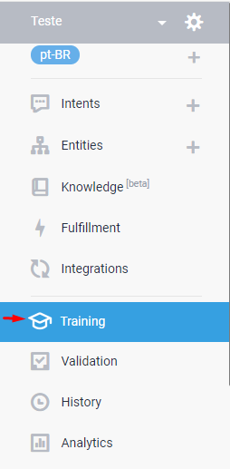

### VALIDAÇÃO
```
Um aspecto importante na utilização do chatbot é validar sua eficácia. Para isso, a plataforma dispobiliza a opção "Validation", disponível apenas
caso a API V2 esteja habilitada. Para acessa-la, basta clicar no ícone na aba lateral direita como demonstra a imagem abaixo.
```
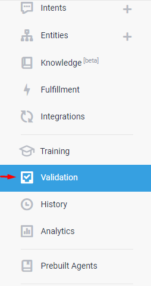
```
Após acessar esta opção, o Dialogflow apresenta de forma interativa os resultados até o atual momento das interações dos usuários com o seu chatbot.
São apresentados os erros, possíveis problemas e características que podem ser melhoradas para uma melhor experiência do usuário com a sua aplicação.
```
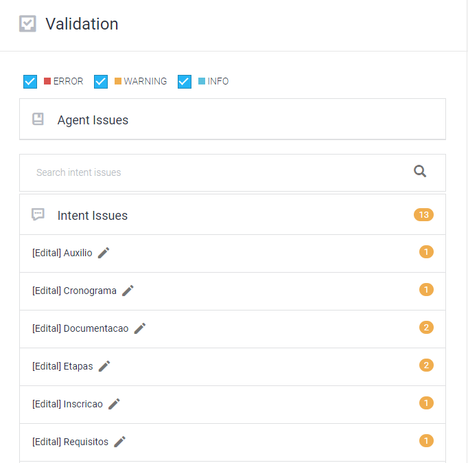
